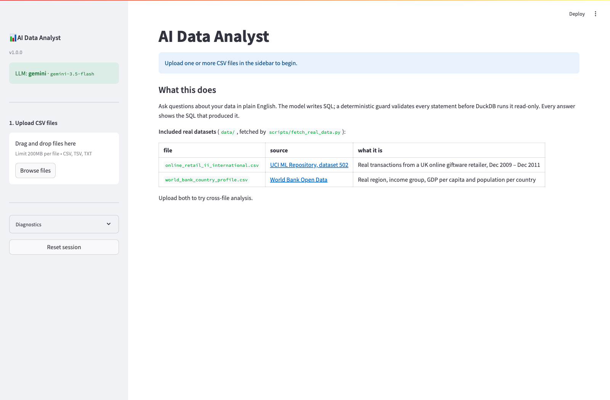
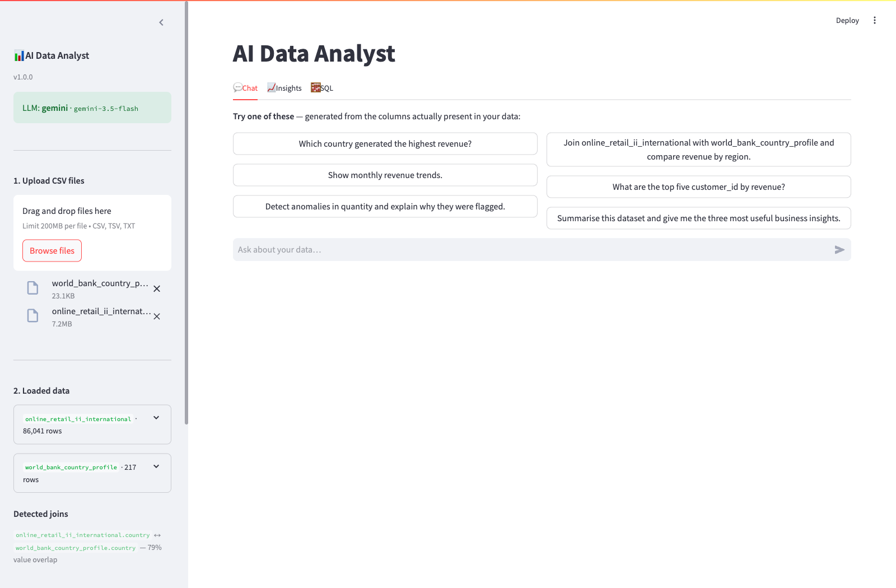
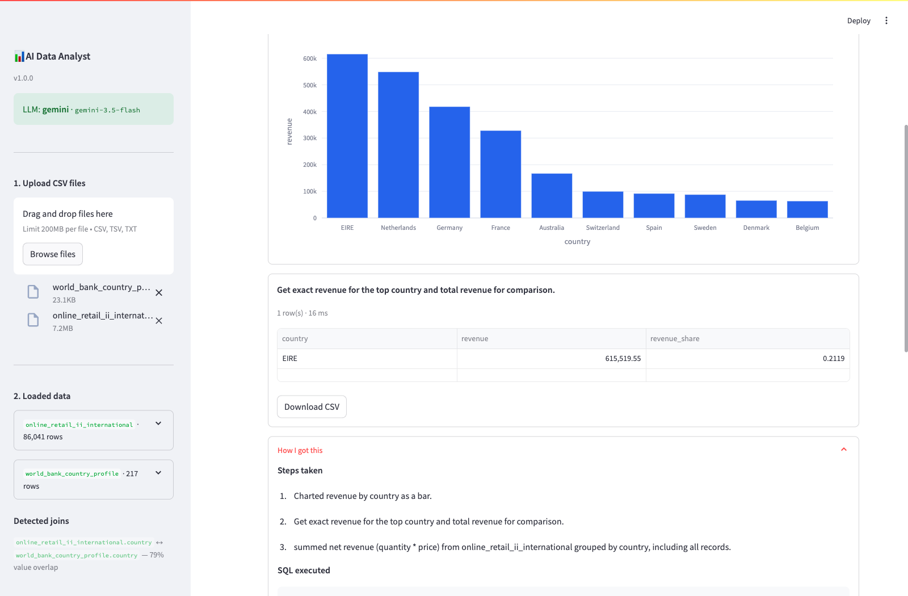

# AI Data Analyst

Upload CSV files, ask questions in plain English, get answers backed by SQL you can
read. Built for the Digital Back Office AI Engineer assignment.

**The design principle:** the LLM proposes and narrates; it never computes or
executes. Every statement it writes is parsed into an AST and validated by a
deterministic guard before DuckDB runs it read-only. Every statistic — anomaly
thresholds, forecasts, quality scores, dashboard KPIs — is computed in
pandas/numpy/scikit-learn. Every answer shows the SQL that produced it.

**The data is real.** Both shipped datasets are public, published data fetched from
source: [UCI Online Retail II](https://archive.ics.uci.edu/dataset/502/online+retail+ii)
(1,067,371 real transactions from a UK online retailer, Dec 2009 – Dec 2011) and
[World Bank Open Data](https://data.worldbank.org). Nothing is generated,
simulated or synthetic. Full provenance in [`data/README.md`](data/README.md).

**Status:** 330 tests passing. Verified end-to-end against the live Gemini API on
the real data — it returns EIRE / 615,519.55, matching the independently computed
pandas ground truth.

---

## Quick start

```bash
git clone <repo-url> && cd ai-data-analyst

make setup          # venv + dependencies + .env from template
# add LLM_API_KEY to .env  (Gemini, Groq and OpenAI all have free tiers)
make data           # download the real datasets from UCI and the World Bank
make ui             # http://localhost:8501
```

With Docker:

```bash
cp .env.example .env    # add your key
docker compose up -d
# UI  http://localhost:8501
# API http://localhost:8000/docs
```

Then upload `data/online_retail_ii_international.csv` and
`data/world_bank_country_profile.csv` and ask:

> Which country generated the highest revenue?

### No API key? Most of the app still works

Upload, validation, profiling, data-quality scoring, direct SQL, charts, anomaly
detection, forecasting, the auto dashboard and report export are all deterministic
and need no credentials. Only natural-language questions and narrated insights
require a key, and the app says so plainly instead of failing.

### Verify everything in one command

```bash
make api-smoke      # no API key needed
```

Exercises the whole deterministic surface end to end against the real files —
upload, validation of a broken file, schema and semantic layer, guarded SQL,
five injection attempts, anomalies, forecast, dashboard, insights, and all three
export formats — and prints the real numbers so the output is checkable rather
than a row of ticks. Sample output:

```
  ok   top country is EIRE  EIRE = 615,519.55
  ok   matches pandas ground truth  expected ~615,519.55, got 615,519.55
  ok   cross-file join ran  top region: Europe & Central Asia
  ok   DROP rejected
  ok   filesystem read rejected
  ok   anomalies found  25 findings
  ok   forecast produced  Holt-Winters exponential smoothing (period=12)
  ok   error reported honestly  MAPE 60.18%
  ok   dashboard built  6 KPIs, 3 panels
  ok   excel export  9,480 bytes
```

---

## Screenshots

| | |
|---|---|
|  |  |
| **Landing** — documents the real datasets and their sources | **After upload** — both real files profiled, quality scored, the country join detected at 79% value overlap, and starter questions generated from the columns actually present |
|  |  |
| **Answer** — EIRE at 615,519.55 with the net-vs-returns caveat the model raised itself, plus the chart it specified | **"How I got this"** — the steps actually taken, the SQL that ran, and the execution trace with per-step latency, token counts and trace id |

**Demo video:** [`docs/demo.mp4`](docs/demo.mp4) — _to record: 25 s, no narration.
Upload both CSVs → ask "Which country generated the highest revenue?" → expand
"How I got this" to show the SQL → open the Dashboard tab → ask for anomalies._

**Live app:** _add your deployment URL here (Streamlit Community Cloud or a
Hugging Face Space both host this for free)._

---

## End-to-end flow, mapped to the code

```
USER
 │
 ▼  open app                          ui/app.py
 ▼  upload CSV file(s)                multi-file, drag & drop, 200 MB each
 ▼  validate & clean                  core/ingest.py    format · encoding · empty ·
 │                                                      duplicate headers · missing
 │                                                      values · wrong types
 ▼  store as pandas DataFrame         core/engine.py    in memory, registered in DuckDB
 ▼  profile the dataset               core/profile.py   rows · cols · dtypes · roles
 │                                                      (measure/dimension/temporal/id)
 ▼  AI understands the dataset        core/semantic.py  schema cards · derived metrics ·
 │                                                      join keys → system prompt
 ▼  user starts chatting              conversation memory across turns
 ▼  AI plans, then picks a tool       core/agent.py     bounded plan→act→observe loop
 │
 ├─ analyze data ──────── run_sql          guarded DuckDB SELECT
 ├─ analyze data ──────── run_pandas       restricted pandas, actually executed
 ├─ create charts ─────── create_chart     validated spec → Plotly
 ├─ detect anomalies ──── detect_anomalies IQR · robust-z · Isolation Forest · STL
 ├─ forecast ──────────── forecast         Holt-Winters / OLS + 95% intervals
 ├─ data quality ──────── data_quality_report
 ├─ find columns ──────── search_columns   lexical search over the data dictionary
 ├─ generate code ─────── generate_code    SQL or pandas, shown not run
 └─ inspect schema ────── inspect_schema   re-read types and sample values
 │
 ▼  collect results
 ▼  explain reasoning                 real steps + executed SQL + trace + `Why:` line
 ▼  final answer + chart + SQL        ui/app.py renders artifacts
 ▼  save conversation memory          core/engine.py session history
 ▼  dashboard · insights · export     core/dashboard.py · core/insights.py · core/reports.py
 ▼  end session                       reset in UI, DELETE /sessions/{id} on the API
```

Phase-by-phase, with where to look and how it is proven:

| Phase | Where | Verified by |
|---|---|---|
| 1–2 Open app, upload one or more CSVs | `ui/app.py` | `make api-smoke` |
| 3 Validate: format, empty, encoding, duplicate columns, missing values, wrong types | `core/ingest.py` | `tests/test_ingest.py` (30 tests) |
| 4 Profile: rows, columns, dtypes, numeric/date/categorical | `core/profile.py` | `tests/test_profile_engine.py` |
| 5 Store as DataFrame in memory | `core/engine.py` | — |
| 6 Chat starts | `ui/app.py` | — |
| 7 **AI planning** — decide which tool | `core/agent.py`, `core/prompts.py` | `tests/test_agent.py` |
| 8 **Tool execution** — pandas *and* SQL | `core/tools/`, `core/pandas_exec.py` | `tests/test_pandas_exec.py` (45 tests) |
| 9 LLM turns numbers into English | `core/prompts.py` | live run |
| 10 Explain reasoning | `core/agent.py`, `core/observability.py` | trace in every answer |
| 11 Charts (Plotly) | `core/charts.py` | `tests/test_analytics.py` |
| 12 Business insights | `core/insights.py` | `tests/test_analytics.py` |
| 13 Generate SQL | `core/tools/query.py` | eval case `generate_sql` |
| 14 Generate pandas code | `core/tools/query.py` | `tests/test_agent.py` |
| 15 Anomalies (Isolation Forest, z-score) | `core/anomaly.py` | `tests/test_analytics.py` |
| 16 Conversation memory | `core/engine.py`, `core/agent.py` | `tests/test_agent.py` |
| 17 Multiple CSVs + relationships | `core/profile.py::detect_join_hints` | 79% overlap detected on the real files |
| 18 Dashboard with KPIs | `core/dashboard.py` | `tests/test_dashboard_reports.py` |
| 19 Export PDF / Excel / MD / HTML | `core/reports.py` | `tests/test_dashboard_reports.py` |
| 20 End session | `core/engine.py::SessionStore` | `tests/test_api.py` |

### Both analysis engines, and why

Phase 8 in the flow runs pandas. This app does that — `run_pandas` executes the
expression the model writes and returns the result — **and** it offers SQL over
DuckDB, letting the model choose. Both paths are cross-checked against each other:
`tests/test_pandas_exec.py::test_pandas_and_sql_agree_on_the_real_data` asserts they
produce the same total on the real 86,041-row file.

Executing model-written Python is the single most dangerous thing an app like this
can do, so `core/pandas_exec.py` fences it four ways: one expression only (parsed
with `mode="eval"`, so assignments, imports and loops are syntax errors), an AST
node allow-list, a pandas method allow-list with dunder access blocked, and
evaluation with empty `__builtins__` and only the DataFrames bound. Plus a
wall-clock budget, a row cap, and a copied frame so a mutating expression cannot
corrupt session data.

`tests/test_pandas_exec.py` throws 21 real escape attempts at it, including
`().__class__.__bases__[0].__subclasses__()`, `__import__('os').system('id')`,
`df.query(...)`, `df.eval(...)` and `df.to_csv('/tmp/leak.csv')`. All are refused
with a reason the agent can act on.

---

## What it does

| Requirement | How |
|---|---|
| Upload and validate one or more CSVs | Encoding and delimiter sniffing, header normalisation, conservative type inference, per-file typed errors, partial-success uploads |
| Answer questions in natural language | Tool-calling agent with 9 tools over both a guarded SQL engine and a restricted pandas executor |
| Business insights and summaries | Statistics computed by SQL, then narrated by the LLM from those numbers only |
| Charts | Model emits a validated JSON chart spec; Plotly renders. 9 chart types |
| Generate SQL / pandas code | `run_sql` and `run_pandas` execute and show the code; `generate_code` returns reviewable code without running it. SQL is guard-validated; pandas passes a restricted-grammar check |
| Detect anomalies and explain them | Tukey IQR, robust z-score (median/MAD), Isolation Forest, STL seasonal residual — each flag reports its method, threshold and observed value |
| Explain its reasoning | The actual steps taken: tool calls, executed SQL, timings, token counts, which model answered, plus a one-line `Why:` basis |
| Conversation context | Rolling window of prior turns with the SQL used, so "and the second one?" resolves |

**Bonus features implemented:** multi-file analysis with automatic join-key
detection · auto-generated KPI dashboard · data-quality scoring · forecasting with
confidence intervals · agentic tool-calling workflow · lexical semantic search over
the data dictionary · answer caching keyed on a schema fingerprint · optional
API-key auth · **PDF / Excel** / Markdown / HTML report export · streaming responses
(SSE) · structured logging with per-turn traces · model fallback chain ·
**an evaluation framework with independently computed ground truth**.

Two items on the bonus list were deliberately **not** built, with reasons:

- **Multi-agent split (Planner → Analyst → Chart Generator → Report Writer).** One
  agent with well-specified tools already performs each of those roles, and every
  step is visible in the trace. Splitting them multiplies LLM round-trips — each one
  latency, cost and a new failure mode — without answering questions any better.
  Judgement call; happy to be argued out of it.
- **Embedding-based semantic search.** `search_columns` does lexical scoring over
  column names *and* real values, which is what actually helps on a wide CSV. It is
  labelled lexical rather than dressed up as semantic.

The suggested stack listed LangGraph. The agent loop here is ~150 hand-written
lines instead: no hidden control flow, unit-testable with a scripted fake provider,
and every transition recorded. A graph runtime earns its place when you need
checkpointed state, resumable branches or human-in-the-loop pauses; a single
analytics turn needs none of those.

---

## Architecture

Full diagrams and rationale: [`docs/architecture.md`](docs/architecture.md).

```
question ──▶ LLM proposes SQL ──▶ deterministic guard ──▶ DuckDB (read-only) ──▶ LLM narrates
                                        │
                                    rejects → error returned to the model, which retries
```

```
core/           the engine — imports neither Streamlit nor FastAPI
├── ingest.py       CSV parsing, encoding/delimiter detection, safe type coercion
├── profile.py      column profiling, role inference, data-quality checks
├── semantic.py     schema cards, derived-metric hints, join keys → prompt context
├── guard.py        sqlglot AST validation (the security boundary)
├── engine.py       DuckDB session, row caps, timeouts, session store
├── agent.py        bounded plan → act → observe loop
├── anomaly.py      four statistical detectors with numeric explanations
├── forecast.py     Holt-Winters / OLS with prediction intervals
├── pandas_exec.py  restricted pandas execution (AST + method allow-lists)
├── charts.py       chart-spec validation and Plotly rendering
├── dashboard.py    deterministic KPI + panel generation
├── insights.py     verified facts (SQL) + narration (LLM)
├── reports.py      Markdown / HTML / Excel export
├── llm/            provider abstraction over raw HTTP + model fallback chain
└── tools/          the nine tools the agent can call

api/main.py     FastAPI: REST + SSE, optional X-API-Key
ui/app.py       Streamlit: Chat · Dashboard · Insights · SQL
evals/          golden question set + pandas ground truth + harness
tests/          330 tests
```

`core/` is UI-free, so the tests and the eval harness run the exact code the app
runs.

### Why the semantic layer is the important part

Published evaluations of LLM-generated SQL find failures are dominated by schema
hallucination and wrong join paths rather than syntax, and that explicit schema
context is what lifts accuracy substantially. So instead of pasting `df.head()`
into a prompt, the model receives exact names and DuckDB types, an inferred
analytical role per column (so it never sums an invoice number), real sample values
and top categories, measured numeric and date ranges, null rates, join keys with
measured value overlap, and the arithmetic for metrics the data does not store.

That last one matters on this data: **Online Retail II has `quantity` and `price`
but no revenue column.** Without being told, a model asked "which country generated
the highest revenue?" either invents a `revenue` column or quietly answers with
`SUM(quantity)` — a different question. The app detects the gap and states the
formula, so the derivation shows up in the SQL the user reads.

---

## Safety

The LLM never executes anything. Seven layers sit between a generated statement
and the database:

1. **Identifier sanitisation** at ingest — a crafted CSV header cannot inject SQL.
2. **AST validation** (sqlglot) — one statement only, SELECT only, no DDL/DML, no
   schema-qualified names, every table on the session allow-list.
3. **Function deny-list** — `read_csv`, `read_parquet`, `glob`, `postgres_scan`,
   `getenv`, extension loading.
4. **Engine hardening** — `enable_external_access=false` then
   `lock_configuration=true`, so filesystem and network access are off and cannot
   be turned back on.
5. **Row cap** — LIMIT injected, or reduced if the model asked for more.
6. **Timeout** — worker thread plus `connection.interrupt()`.
7. **Fenced pandas execution** — one expression, AST node allow-list, pandas method
   allow-list, no dunder access, empty `__builtins__`, wall-clock budget, row cap,
   copied frame. There is no bare `eval`/`exec` of model text anywhere.

`tests/test_guard.py` covers 40 SQL cases including `SELECT 1; DROP TABLE sales`,
`read_csv_auto('/etc/passwd')` and a header crafted as `"a"; DROP TABLE x; --`.
`tests/test_pandas_exec.py` covers 21 Python sandbox escapes including
`().__class__.__bases__[0].__subclasses__()` and `__import__('os').system('id')`.

Note: **the API has no auth unless you set `APP_API_KEY`.** Fine on localhost; set
it before exposing the service.

---

## Model configuration

The provider layer talks raw HTTP to Gemini, Groq and OpenAI — one dependency, one
upgrade path, and an identical tool-calling contract, so the agent contains no
provider conditionals.

Two things about Gemini 3, both established against the live API rather than from
documentation:

**Gemini 3.x replaced the sampling parameters.** `temperature`, `top_p` and `top_k`
are deprecated; reasoning depth is controlled by `thinkingLevel`
(`minimal|low|medium|high`). The provider omits the deprecated fields entirely for
3.x models and sends `thinkingConfig` instead. It also counts `thoughtsTokenCount`
toward output tokens, because thinking tokens are billed.

**Gemini 3 returns a `thoughtSignature` on every function-call part**, and it must
be echoed back on the following request or the model loses the reasoning that
produced the call. `ToolCallRequest.provider_state` carries it through the loop.

**Free-tier quota is 20 requests per day, per model**
(`GenerateRequestsPerDayPerProjectPerModel-FreeTier`), and Gemini 3 **Pro** models
return 429 immediately — they have no free-tier quota at all. One analytical
question costs 4–8 requests. Since the quota is per model, `LLM_FALLBACK_MODELS`
defines a chain that is tried in order; the model that actually answered is
recorded in the trace, so a Flash-Lite answer is never mistaken for a
frontier-model answer. Fallback triggers only on quota errors — a malformed
request still surfaces as a real failure.

---

## Testing

```bash
make test           # 330 tests, no API key needed
make test-cov       # with coverage
make eval-offline   # pandas vs DuckDB cross-check
make eval           # full LLM evaluation (needs a key)
make truth          # print the independently computed ground truth
```

Agent behaviour is tested with a scripted fake provider, so the loop's real
mechanics — tool dispatch, self-repair after a hallucinated column, refusal to
repeat an identical call, step budget, cache correctness — are asserted with no
network and no cost. The tools underneath run against the real 86,041-row dataset.

### The evaluation framework

`evals/` holds a golden set of 13 questions covering the assignment's examples plus
multi-file joins, anomaly explanation, code generation and data quality.

Two things make it more than a smoke test:

**Ground truth is computed independently in pandas** (`evals/ground_truth.py`), not
by the DuckDB path the app uses. If the two disagree, one is wrong and the eval
fails. A ground truth produced by the system under test proves nothing.

**Three cases must be refused.** The retail file has no cost, margin or marketing
column, and the committed slice has no UK rows. The correct answer to "what was the
profit margin by country?" is that it cannot be computed. An eval suite containing
only answerable questions rewards a model for guessing.

Answers are graded by extracting numbers from the prose and matching within
tolerance, so `615,519.55`, `£615.5k` and `about 616 thousand` all pass while a
genuinely wrong figure fails.

#### Measured result

Run on `gemini-3.5-flash` with the fallback chain, `assignment-example` slice:

| | |
|---|---|
| Cases passed | **5 / 6 (83%)** |
| Individual checks passed | **20 / 21 (95%)** |
| Median latency | 16.8 s |
| Tokens | 115,009 in · 9,116 out |

The single failure was **not a wrong answer** — it was an HTTP 400 on a
conversational follow-up, caused by a real bug the harness caught (see below). The
remaining 7 cases were not run because the free-tier daily quota was exhausted;
`python evals/run.py --json results.json` runs the full set.

The generated SQL was genuinely good: CTEs, net-vs-gross revenue splits, and
`DATE_TRUNC` with ordering by the raw date rather than the formatted label.

---

## Bugs this project found in itself

Worth listing because each was found by running real data or a real API through the
system, and each has a regression test.

| Bug | Found by | Fix |
|---|---|---|
| A 95%-tolerance numeric coercion silently turned every `C`-prefixed credit-note invoice into NULL — real data loss that corrupts downstream aggregates | Loading the real UCI file | Coerce only when every non-null value converts or is a recognised missing-value token. Recovered 736 destroyed invoice values |
| "Most measure columns" picked the 217-row World Bank lookup table over the 86,041-row transaction table as the default fact table | Loading both real files together | Rank by has-date-column, then row count |
| The step-budget fallback call omitted tool declarations; Gemini rejects a request whose history references undeclared tools (HTTP 400) | The eval harness, against the live API | Always declare tools on the final call |
| `**Why:**` — the bolded form models actually emit — was parsed into `** bold form.` | Unit test on real model output shapes | Regex covering bold, italic, quoted and bulleted forms |
| SIGSEGV under Streamlit. The macOS crash report put the faulting frame in pyarrow's bundled mimalloc allocator (`mi_thread_init`) reached from `Table.from_pandas`, which is what `st.dataframe` calls on Streamlit's per-execution worker thread | Running the UI | `ARROW_DEFAULT_MEMORY_POOL=system` set before pyarrow loads, plus `threadpool_limits(1)` around the scikit-learn and STL fits |
| The schema panel mixed floats and date strings in one column, so Arrow rejected the whole frame and took the panel down | `tests/test_ui_runtime.py` | Format bounds to text first; a test proves the raw form still raises |

---

## Configuration

Every setting is an environment variable; see [`.env.example`](.env.example).

| | default | |
|---|---|---|
| `LLM_PROVIDER` | `none` | `gemini` · `groq` · `openai` · `none` |
| `LLM_MODEL` | `gemini-3.6-flash` | |
| `LLM_FALLBACK_MODELS` | — | Comma-separated chain tried on quota errors |
| `LLM_THINKING_LEVEL` | `high` | Gemini 3.x only |
| `MAX_RESULT_ROWS` | `5000` | Guard-enforced row cap |
| `QUERY_TIMEOUT_S` | `30` | |
| `MAX_AGENT_STEPS` | `6` | Bounds cost per question |
| `APP_API_KEY` | — | Blank disables API auth |
| `LOG_JSON` | `true` | JSON lines, or coloured dev output |

---

## API

```bash
curl -s localhost:8000/health | jq
SID=$(curl -sX POST localhost:8000/sessions | jq -r .session_id)

curl -sX POST localhost:8000/sessions/$SID/datasets \
  -F files=@data/online_retail_ii_international.csv \
  -F files=@data/world_bank_country_profile.csv | jq '.loaded[].table'

curl -sX POST localhost:8000/sessions/$SID/chat \
  -H 'content-type: application/json' \
  -d '{"question":"Which country generated the highest revenue?"}' | jq -r .answer_markdown
```

| | |
|---|---|
| `GET /health` · `GET /metrics` | Status, limits, cache stats |
| `POST /sessions` · `GET`/`DELETE /sessions/{id}` | Session lifecycle |
| `POST /sessions/{id}/datasets` | Multi-file upload, partial success |
| `GET /sessions/{id}/schema` · `/quality` | Profiles, join hints, prompt context |
| `POST /sessions/{id}/chat` | Full answer with artifacts, SQL and trace |
| `POST /sessions/{id}/chat/stream` | SSE: live tool progress, then the answer |
| `POST /sessions/{id}/sql` | Guarded direct SQL — no LLM |
| `POST /sessions/{id}/anomalies` · `/forecast` | Deterministic analytics — no LLM |
| `GET /sessions/{id}/dashboard` | Auto KPIs + chart panels — no LLM |
| `GET /sessions/{id}/insights` · `/insights/stream` | Facts + narration; token streaming |
| `GET /sessions/{id}/report?format=pdf\|xlsx\|markdown\|html` | Session export |

Interactive docs at `/docs`.

---

## Assumptions and implementation notes

**On the data**

- The committed retail slice excludes `Country = 'United Kingdom'` so the file is
  7 MB instead of 95 MB. Rows are otherwise untouched — nothing edited, imputed or
  removed. Run `python scripts/fetch_real_data.py --full` for all 1,067,371 rows.
  Consequence: revenue rankings here are led by EIRE, not the UK.
- Revenue is `quantity * price`; the source has no revenue column.
- Negative quantities are real returns and credit notes (`C`-prefixed invoices),
  not errors. The app flags this and asks the model to state whether a given answer
  is gross or net.
- The country join covers 33 of 42 names. `EIRE`/`Ireland`, `USA`/`United States`,
  `RSA`/`South Africa` and `Czech Republic`/`Czechia` differ between the two
  publishers, and `Unspecified`/`European Community` are not countries. No mapping
  table was invented; the app measures and displays the real 79% overlap.
- Revenue is summed over DOUBLE columns, so DuckDB and pandas can differ by a few
  pence on a six-figure total (float accumulation order). Cast to `DECIMAL` if you
  need exact currency arithmetic.

**On the engineering**

- Sessions live in the process, so the API runs one replica (`--workers=1`).
  Redis plus object storage is the change needed to scale out.
- Whole files are held in memory — comfortable to a few million rows.
- The Streamlit UI imports `core` directly rather than calling the API over HTTP.
  Both are peer consumers of the engine; in-process avoids serialising DataFrames
  on every turn. Each service therefore keeps its own sessions.
- Conversation memory is a rolling window, not a summarising memory, so very long
  sessions lose early context.
- `/chat/stream` streams real tool-progress events; token-level streaming is on
  `/insights/stream`, where the call needs no tools and streaming costs nothing
  extra.

**Not implemented**

Row-level access control, multi-tenancy, user accounts (the API has shared-secret
auth, not per-user login), a persistent warehouse connector, embedding-based
semantic search, and a multi-agent Planner/Analyst/Charter split. Reasons for the
last two are in the bonus-features section above.

---

## Licences

Code: MIT. Data: CC BY 4.0 from
[UCI ML Repository](https://archive.ics.uci.edu/dataset/502/online+retail+ii)
(donated by Dr Daqing Chen, London South Bank University) and
[World Bank Open Data](https://data.worldbank.org).
