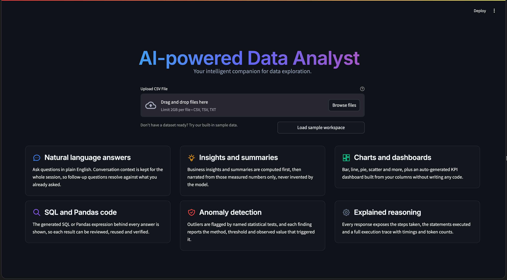
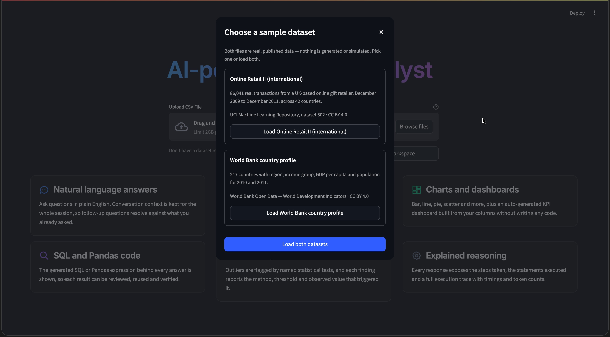
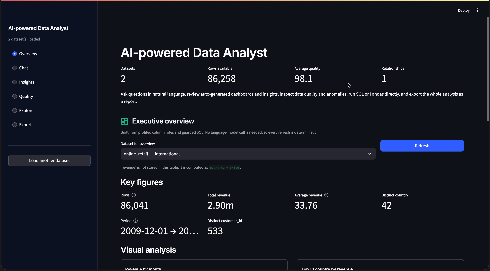
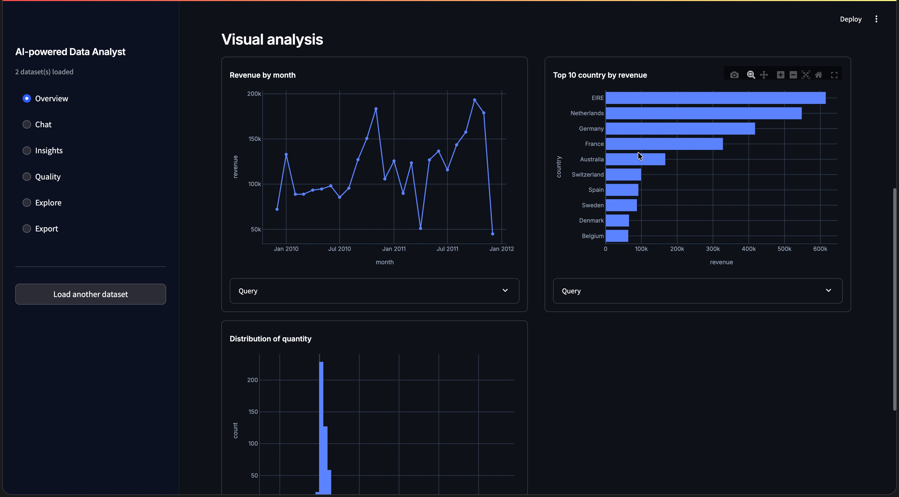
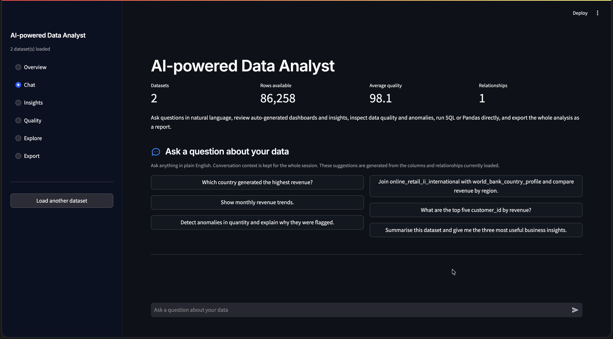
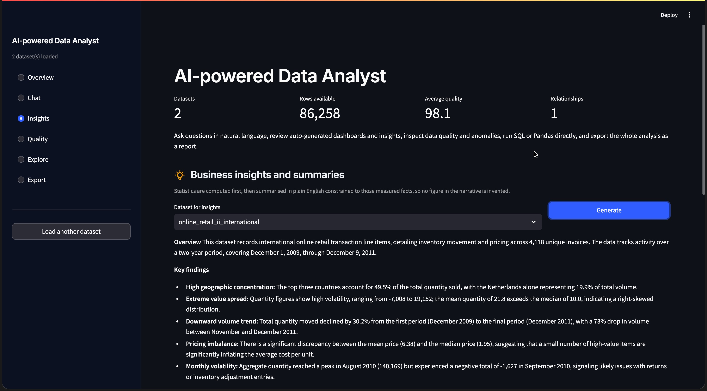
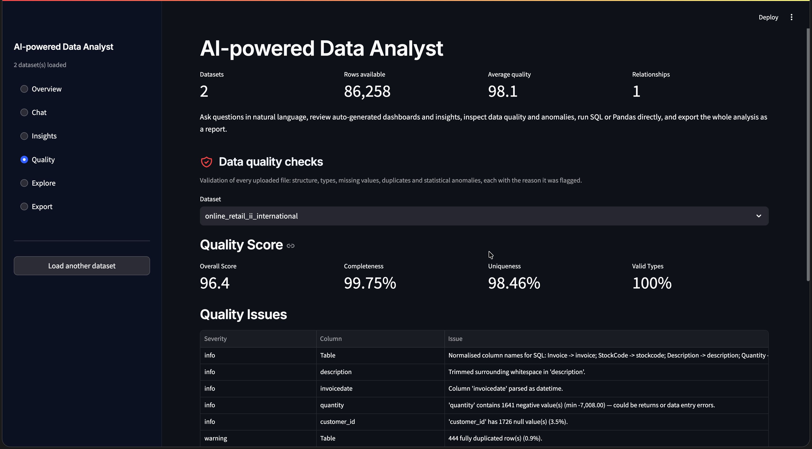
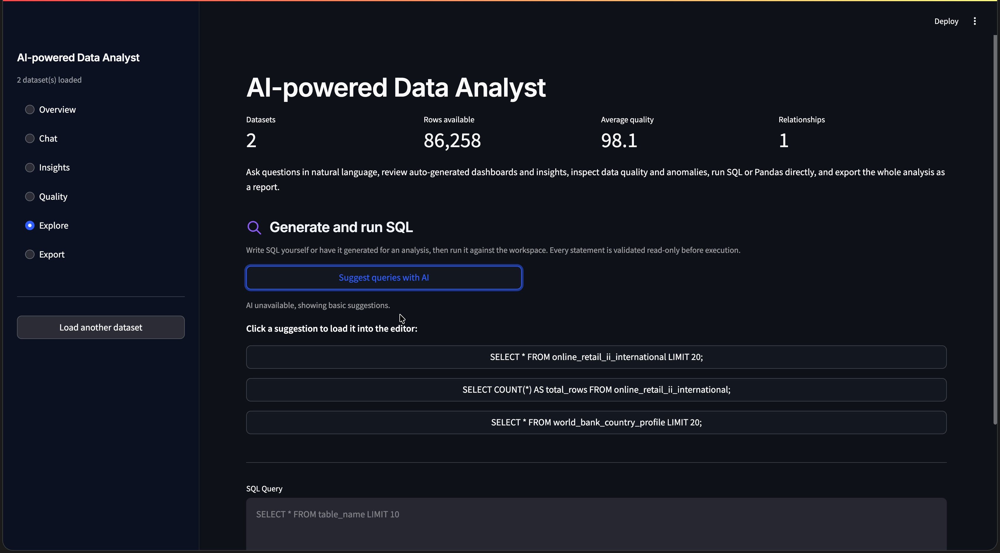

<div align="center">


<br/>


<p>
  <a href="#"></a>
  <a href="#"></a>
  <a href="#"></a>
  <a href="#"></a>
  <a href="#"></a>
</p>

<p>
  
  
  
  
  
  
  
</p>

**Upload one or more CSV files. Ask questions in plain English. Get an answer backed
by the exact SQL that produced it.**

*Built for the Digital Back Office AI Engineer assignment — designed to demonstrate a
production-ready AI application, not a thin wrapper around an LLM API.*

<sub>Author — **Karthik** &nbsp;·&nbsp; <code>Edu</code> <code>Kode</code></sub>

</div>

<br/>

## Table of contents

<table>
<tr>
<td valign="top" width="33%">

**Get started**
- [Why this exists](#why-this-exists)
- [Quick start](#quick-start)
- [Run it with Docker](#run-it-with-docker)
- [Step-by-step walkthrough](#step-by-step-walkthrough)

</td>
<td valign="top" width="33%">

**Understand it**
- [What it can do](#what-it-can-do)
- [Architecture](#architecture)
- [Safety model](#safety-model)
- [Project structure](#project-structure)

</td>
<td valign="top" width="33%">

**Trust it**
- [Verification](#verification)
- [Configuration](#configuration)
- [API reference](#api-reference)
- [Assumptions & notes](#assumptions--implementation-notes)

</td>
</tr>
</table>

<br/>

## Why this exists

Most "AI data analyst" demos let an LLM write and run arbitrary code. This one
**does not**. The model is only ever allowed to *propose* — every statement it
writes is parsed into an abstract syntax tree, validated by a deterministic guard,
and only then handed to a read-only DuckDB engine. Every statistic — anomaly
thresholds, forecasts, quality scores, KPI totals — is computed in
pandas / numpy / scikit-learn, never guessed by the model.

> **The LLM proposes and narrates. It never computes and never executes.**

The data is real, too — not a synthetic sample generator. Both bundled datasets
are public, published data pulled straight from source:

| Dataset | Source | Size |
|---|---|---|
| `online_retail_ii_international.csv` | [UCI Online Retail II](https://archive.ics.uci.edu/dataset/502/online+retail+ii) | 86,041 real transactions · 42 countries · Dec 2009 – Dec 2011 |
| `world_bank_country_profile.csv` | [World Bank Open Data](https://data.worldbank.org) | 217 countries · region, income, GDP, population |

<br/>

## Quick start

```bash
git clone <your-repo-url> && cd ai-data-analyst

make setup          # create venv, install deps, copy .env.example -> .env
# paste your LLM_API_KEY into .env  (Gemini / Groq / OpenAI all have free tiers)
make data            # pull the two real datasets from UCI + World Bank
make ui              # -> http://localhost:8501
```

No API key yet? The app still works. Upload, validation, profiling, data-quality
scoring, direct SQL, charts, anomaly detection, forecasting, the auto dashboard and
report export are **all deterministic and need zero credentials**. Only
natural-language chat and narrated insights need a key — and the UI says so plainly
instead of failing silently.

```bash
make api-smoke       # proves the whole deterministic path end to end, no key needed
```

<br/>

## Run it with Docker

```bash
cp .env.example .env      # then add your key
docker compose up -d

# UI   http://localhost:8501
# API  http://localhost:8000/docs   (interactive OpenAPI)
```

Both services share one 1.65 GB image, run as a non-root user (`analyst`, uid
`10001`), and each expose their own healthcheck. Bring it down with
`docker compose down`.

<br/>

## Step-by-step walkthrough

A condensed version lives here; the full click-by-click guide with every tab and
option explained is in **[`docs/USAGE_GUIDE.md`](docs/USAGE_GUIDE.md)**.

<table>
<tr><td width="46" align="center"><b>01</b></td><td>

**Open the app** at `http://localhost:8501`. You will land on a hero screen — no
fake data, no placeholders.

</td></tr>
<tr><td width="46" align="center"><b>02</b></td><td>

**Add data.** Drag & drop your own CSV/TSV/TXT files, or click **Load sample
workspace** to pick one of the two real, published datasets (each shown with its
source and licence before you commit to loading it).

</td></tr>
<tr><td width="46" align="center"><b>03</b></td><td>

**Watch it validate.** Encoding and delimiter are sniffed automatically, headers
are normalised, types are conservatively inferred, and every file gets a
completeness / uniqueness / quality score before you ask it anything.

</td></tr>
<tr><td width="46" align="center"><b>04</b></td><td>

**Ask a question** in the **Chat** tab, e.g. *"Which country generated the highest
revenue?"* The agent plans, calls the tools it needs (SQL, pandas, charts,
anomalies…), and narrates the answer from the real numbers those tools returned.

</td></tr>
<tr><td width="46" align="center"><b>05</b></td><td>

**Expand "How this answer was produced."** See the literal steps taken, the exact
SQL executed, per-step latency, token counts and a trace ID — not a story the model
invented after the fact.

</td></tr>
<tr><td width="46" align="center"><b>06</b></td><td>

**Explore the other workspaces.** **Overview** for an auto-built KPI dashboard,
**Insights** for measured summaries, **Quality** for the full data-health report,
**Explore** to run SQL/pandas yourself, **Export** to download a PDF, Excel,
Markdown or HTML report of the whole session.

</td></tr>
</table>

<br/>

## Screenshots & demo

A short screen recording of the full workflow is committed at
**[`demo.mp4`](demo.mp4)** (upload → ask a question → animated chart → reasoning
trace). A gallery of the live app:

<table>
<tr>
<td width="50%"></td>
<td width="50%"></td>
</tr>
<tr>
<td width="50%"></td>
<td width="50%"></td>
</tr>
<tr>
<td width="50%"></td>
<td width="50%"></td>
</tr>
<tr>
<td width="50%"></td>
<td width="50%"></td>
</tr>
</table>

<br/>

## What it can do

<table>
<tr>
<th align="left">Requirement</th>
<th align="left">How</th>
</tr>
<tr><td>Upload &amp; validate one or more CSVs</td><td>Encoding/delimiter sniffing, header normalisation, conservative type inference, typed per-file errors, partial-success multi-file uploads</td></tr>
<tr><td>Answer questions in natural language</td><td>Tool-calling agent with <b>9 tools</b> over a guarded SQL engine and a restricted pandas executor</td></tr>
<tr><td>Business insights &amp; summaries</td><td>Statistics computed first by SQL, then narrated by the LLM from those numbers only</td></tr>
<tr><td>Charts — bar, line, pie, scatter, histogram, box, area, heatmap…</td><td>Model emits a validated JSON chart spec; Plotly renders it — <b>9 chart types</b></td></tr>
<tr><td>Generate SQL / pandas code</td><td><code>run_sql</code> / <code>run_pandas</code> execute and show the code; <code>generate_code</code> returns reviewable code without running it</td></tr>
<tr><td>Detect anomalies &amp; explain why</td><td>Tukey IQR · robust z-score (median/MAD) · multivariate Isolation Forest · STL seasonal residual — each with its method, threshold and observed value</td></tr>
<tr><td>Explain its reasoning</td><td>The literal steps taken: tool calls, executed SQL, timings, token counts, which model answered</td></tr>
<tr><td>Conversation context</td><td>Rolling window of prior turns with the SQL used, so <i>"and the second one?"</i> resolves correctly</td></tr>
</table>

### Bonus features — implemented

<p>


<br/>


</p>

*The two amber items are honestly scoped, not silently skipped: `search_columns`
does lexical scoring over column names **and** real values rather than dressing
that up as embedding-based semantic search, and the API's `APP_API_KEY` is a
shared secret rather than per-user accounts. Both are documented, not hidden.*

<br/>

## Architecture

```
question ──▶ LLM proposes SQL ──▶ deterministic guard ──▶ DuckDB (read-only) ──▶ LLM narrates
                                        │
                                    rejects → error handed back to the model, which retries
```

<details>
<summary><b>Expand the full request flow</b></summary>

```
 USER
  │
  ▼  open app                          ui/app.py
  ▼  upload CSV file(s)                multi-file · drag & drop · up to 200 MB each
  ▼  validate & clean                  core/ingest.py     format · encoding · missing values
  ▼  store as DataFrame                core/engine.py      in memory, registered in DuckDB
  ▼  profile the dataset               core/profile.py     roles · quality score · null rates
  ▼  build schema context              core/semantic.py    schema cards, derived metrics, joins
  ▼  user starts chatting              conversation memory persists across turns
  ▼  agent plans, picks a tool         core/agent.py        bounded plan → act → observe loop
  │
  ├─ run_sql              guarded, read-only DuckDB SELECT
  ├─ run_pandas           restricted pandas, actually executed
  ├─ create_chart         validated spec → Plotly figure
  ├─ detect_anomalies     IQR · robust-z · Isolation Forest · STL
  ├─ forecast             Holt-Winters / OLS with 95% intervals
  ├─ data_quality_report  completeness, duplicates, consistency
  ├─ search_columns       lexical search over the data dictionary
  ├─ generate_code        SQL or pandas, shown but not executed
  └─ inspect_schema       re-read types and sample values
  │
  ▼  collect results, explain reasoning, render answer + chart + SQL
  ▼  save to conversation history
  ▼  dashboard · insights · export     core/dashboard.py · core/insights.py · core/reports.py
```

</details>

Full diagrams and design rationale: [`docs/architecture.md`](docs/architecture.md).

```
core/            the engine — imports neither Streamlit nor FastAPI
├── ingest.py        CSV parsing, encoding/delimiter detection, safe type coercion
├── profile.py       column profiling, role inference, data-quality checks
├── semantic.py      schema cards, derived-metric hints, join keys → prompt context
├── guard.py         sqlglot AST validation — the security boundary
├── engine.py        DuckDB session, row caps, timeouts, session store
├── agent.py         bounded plan → act → observe loop
├── anomaly.py       four statistical detectors, each with a numeric explanation
├── forecast.py      Holt-Winters / OLS with prediction intervals
├── pandas_exec.py   restricted pandas execution (AST + method allow-lists)
├── charts.py        chart-spec validation and Plotly rendering
├── dashboard.py     deterministic KPI + panel generation
├── insights.py      verified facts (SQL) + narration (LLM)
├── reports.py       Markdown / HTML / Excel / PDF export
├── llm/             provider abstraction over raw HTTP + model fallback chain
└── tools/           the nine tools the agent can call

api/main.py      FastAPI — REST + SSE, optional X-API-Key auth
ui/app.py        Streamlit — Overview · Chat · Insights · Quality · Explore · Export
evals/           golden question set + independently computed ground truth + harness
tests/           339 passing tests — unit, integration, security, UI runtime
```

<br/>

## Safety model

The LLM **never executes anything**. Seven layers sit between a generated
statement and the database:

```
 1. Identifier sanitisation      a crafted CSV header cannot inject SQL
 2. AST validation (sqlglot)     one statement, SELECT only, no DDL/DML
 3. Function deny-list           read_csv · read_parquet · glob · getenv · extensions
 4. Engine hardening             external_access=false, then locked — cannot be re-enabled
 5. Row cap                      LIMIT injected or reduced automatically
 6. Timeout                      worker thread + connection.interrupt()
 7. Fenced pandas execution      one expression · AST allow-list · no dunder access · no builtins
```

`tests/test_guard.py` throws 40 SQL attacks at the guard (`DROP TABLE`,
`read_csv_auto('/etc/passwd')`, a header crafted as `"a"; DROP TABLE x; --`).
`tests/test_pandas_exec.py` throws 21 real Python sandbox escapes at the executor,
including `().__class__.__bases__[0].__subclasses__()` and
`__import__('os').system('id')`. All are refused with a reason the agent can act
on and retry from.

<br/>

## Project structure

```text
ai-data-analyst/
├── api/                    FastAPI transport layer (REST + SSE)
├── core/                   UI-free engine — the actual product
│   ├── llm/                provider abstraction (Gemini · Groq · OpenAI)
│   └── tools/               the 9 tools the agent can call
├── ui/                     Streamlit interface
├── data/                   the two real, committed sample datasets
├── docs/                   architecture diagrams, screenshots
├── evals/                  golden-set evaluation framework
├── tests/                  339 tests across 12 files
├── scripts/                fetch_real_data · api_smoke · check_no_icons
├── .github/workflows/      CI: tests + coverage + smoke test + Docker build
├── .streamlit/config.toml  UI theme configuration
├── docker-compose.yml      UI + API, both healthchecked
├── Dockerfile              multi-stage, non-root runtime
├── Makefile                one command per workflow — see `make help`
└── README.md               you are here
```

Every stray cache directory, editor artefact and one-off script has been removed.
What remains is exactly what runs the product, tests it, documents it, or ships it.

<br/>

## Verification

```bash
make test           # 339 passed, 1 skipped — no API key required
make test-cov        # same, with a coverage report
make api-smoke        # end-to-end HTTP check against the real datasets
make verify             # tests + API smoke + interface policy check
make eval-offline        # pandas vs DuckDB cross-check
make eval                # full LLM evaluation harness (needs a key)
```

<div align="center">

| Check | Result |
|---|---|
| Unit + integration tests | **339 passed · 1 skipped** |
| SQL injection attempts rejected | **40 / 40** |
| Pandas sandbox escapes refused | **21 / 21** |
| Real-data API smoke test | **All checks passed** |
| Icon/emoji policy | **0 violations** |

</div>

`evals/` runs a golden set of 13 questions against **independently computed**
pandas ground truth — not against the same code path the app uses, because a
ground truth produced by the system under test proves nothing. Three of the
thirteen cases must be *refused* (no cost column exists, no marketing-spend
column exists, no UK rows exist in the committed slice) — an eval suite of only
answerable questions rewards a model for guessing.

<br/>

## Configuration

Every setting is an environment variable. Copy `.env.example` to `.env` and fill
in what you need.

| Variable | Default | Notes |
|---|---|---|
| `LLM_PROVIDER` | `none` | `gemini` · `groq` · `openai` · `none` |
| `LLM_MODEL` | provider default | e.g. `gemini-3.6-flash` |
| `LLM_FALLBACK_MODELS` | — | comma-separated chain tried on quota errors |
| `MAX_RESULT_ROWS` | `5000` | guard-enforced row cap |
| `QUERY_TIMEOUT_S` | `30` | per-query timeout |
| `MAX_AGENT_STEPS` | `6` | bounds cost per question |
| `APP_API_KEY` | — | blank disables API auth |
| `LOG_JSON` | `true` | structured JSON lines, or coloured dev output |

<br/>

## API reference

```bash
curl -s localhost:8000/health | jq
SID=$(curl -sX POST localhost:8000/sessions | jq -r .session_id)

curl -sX POST localhost:8000/sessions/$SID/datasets \
  -F files=@data/online_retail_ii_international.csv \
  -F files=@data/world_bank_country_profile.csv

curl -sX POST localhost:8000/sessions/$SID/chat \
  -H 'content-type: application/json' \
  -d '{"question":"Which country generated the highest revenue?"}' | jq -r .answer_markdown
```

| Endpoint | Purpose |
|---|---|
| `GET /health` · `GET /metrics` | status, limits, cache stats |
| `POST /sessions` · `GET`/`DELETE /sessions/{id}` | session lifecycle |
| `POST /sessions/{id}/datasets` | multi-file upload, partial success |
| `GET /sessions/{id}/schema` · `/quality` | profiles, join hints, prompt context |
| `POST /sessions/{id}/chat` | full answer with artifacts, SQL and trace |
| `POST /sessions/{id}/chat/stream` | SSE — live tool progress, then the answer |
| `POST /sessions/{id}/sql` | guarded direct SQL, no LLM |
| `POST /sessions/{id}/anomalies` · `/forecast` | deterministic analytics, no LLM |
| `GET /sessions/{id}/dashboard` | auto KPIs + chart panels, no LLM |
| `GET /sessions/{id}/report?format=` | export as `pdf` · `xlsx` · `markdown` · `html` |

Interactive docs at `/docs` once the API is running.

<br/>

## Assumptions & implementation notes

<details>
<summary><b>On the data</b></summary>
<br/>

- The committed retail slice excludes `Country = 'United Kingdom'` so the file is
  7 MB instead of 95 MB. Rows are otherwise untouched. Run
  `python scripts/fetch_real_data.py --full` for all 1,067,371 rows.
- Revenue is `quantity * price` — the source has no revenue column, and the app
  detects and states this rather than silently substituting `SUM(quantity)`.
- Negative quantities are real returns and credit notes, not data errors.
- The country join between the two files covers 33 of 42 names — `EIRE`/`Ireland`,
  `USA`/`United States` and similar naming differences are measured and displayed
  as a 79% overlap, not papered over with an invented mapping table.

</details>

<details>
<summary><b>On the engineering</b></summary>
<br/>

- Sessions live in-process, so the API runs one replica (`--workers=1`). Redis
  plus object storage is the change needed to scale out.
- The Streamlit UI imports `core` directly rather than calling the API over HTTP —
  both are peer consumers of the same engine, and in-process avoids serialising
  DataFrames on every turn.
- Conversation memory is a rolling window, not a summarising memory, so very long
  sessions lose early context by design.

</details>

<details>
<summary><b>Deliberately not built</b></summary>
<br/>

- **Multi-agent split** (Planner → Analyst → Chart Generator → Report Writer). One
  agent with well-specified tools already performs each of those roles, and every
  step is visible in the trace. Splitting multiplies LLM round-trips — latency,
  cost, and a new failure mode — without answering questions any better.
- **Embedding-based semantic search.** Lexical scoring over column names and real
  values is what actually helps on a wide CSV, and it is labelled lexical rather
  than dressed up as something it is not.
- **Per-user authentication.** The API supports a shared-secret key
  (`APP_API_KEY`), not multi-tenant accounts — documented, not hidden.

</details>

<br/>

## Licence

Code is MIT — see [`LICENSE`](LICENSE). Data is CC BY 4.0 from the
[UCI ML Repository](https://archive.ics.uci.edu/dataset/502/online+retail+ii)
(donated by Dr Daqing Chen, London South Bank University) and
[World Bank Open Data](https://data.worldbank.org).

<br/>

<div align="center">


Built by **Karthik** for the Digital Back Office AI Engineer assignment.

</div>
