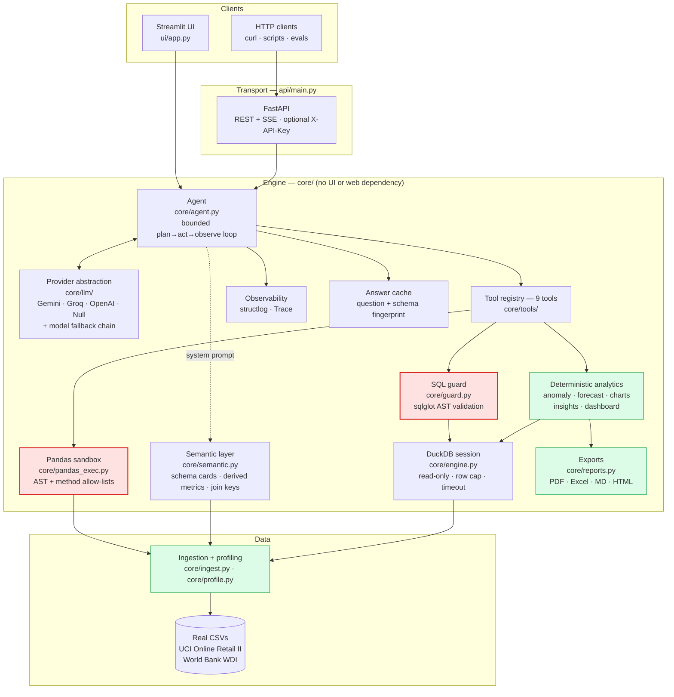
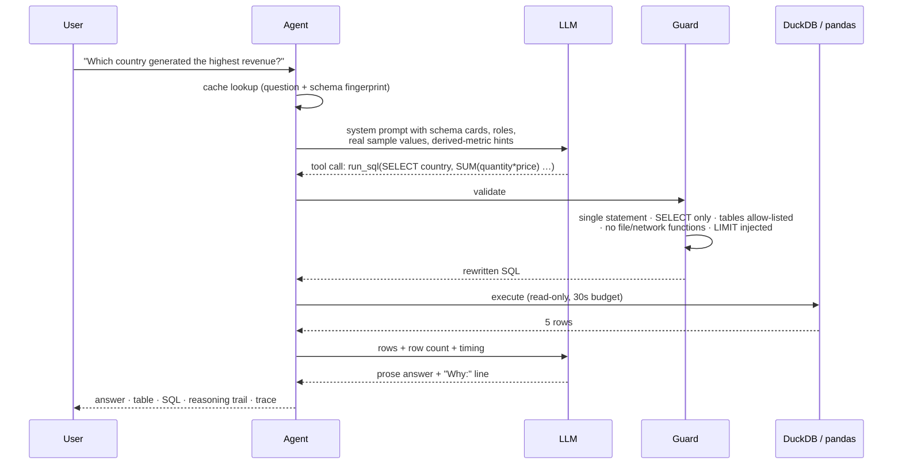

# Architecture

## The core idea

An LLM is good at turning a vague business question into a precise query. It is
bad at arithmetic, and it will confidently invent a column name. So the model is
allowed to *propose* and *narrate*, and is never allowed to *compute* or *execute*.

```
question ──▶ LLM proposes SQL ──▶ deterministic guard ──▶ DuckDB executes ──▶ LLM narrates result
                                        │
                                    rejects → error text goes back to the model, which retries
```

Every number the user sees came out of a query that is shown to them. The
statistics (anomaly thresholds, forecasts, quality scores) are computed in
pandas/numpy/scikit-learn, never by the model.

## System diagram



Red is a security boundary — there are two, because the app has two execution
engines. Green is deterministic: those paths need no API key and give the same
answer every time.

## The two execution engines

The model picks between them per question, and both are fenced.

| | `run_sql` | `run_pandas` |
|---|---|---|
| Engine | DuckDB, read-only | pandas, in-process |
| Good at | grouping, ranking, filtering, joins across files | `describe()`, `pct_change`, rolling windows, str/dt accessors, correlations |
| Validation | sqlglot AST: one SELECT, table allow-list, function deny-list | `ast.parse(mode="eval")`: one expression, node allow-list, method allow-list, no dunders |
| Namespace | only registered tables | only the DataFrames; `__builtins__` emptied |
| Limits | row cap, 30 s timeout, engine hardening | row cap, 20 s budget, copied frame |
| Escape tests | 40 (`tests/test_guard.py`) | 21 (`tests/test_pandas_exec.py`) |

They are cross-checked against each other: `test_pandas_and_sql_agree_on_the_real_data`
asserts both produce the same revenue total on the real 86,041-row file.

### Why executing pandas is safe enough to do here

`mode="eval"` is the load-bearing decision. It means the parser rejects assignments,
imports, loops, `with`, semicolon chains and comprehension tricks as *syntax errors*
before any validation logic runs — the dangerous constructs are unrepresentable
rather than merely blocked. The allow-lists then reduce what remains to data
manipulation, and blocking any attribute starting with `_` closes the standard
`().__class__.__bases__[0].__subclasses__()` route to arbitrary classes.

When something legitimate gets refused, the error names the reason and the agent
falls back to SQL, which is the more capable path anyway. A false negative costs one
retry; a false positive would cost remote code execution.

## Request flow for one question



If the guard rejects, or a column does not exist, the error text is returned to
the model as the tool result and it retries with a corrected call. An identical
repeated call is refused, which is the usual way a tool-calling loop spins.

## Why these choices

**DuckDB** queries DataFrames in-process with no load step, makes cross-file joins
free, and is a sandbox by construction — a bad generated query cannot reach a real
warehouse.

**sqlglot** parses to an AST, so validation is structural rather than regex-based.
String scanning is used only as a secondary check, after literals are stripped so
data cannot trip it.

**A hand-written agent loop** instead of a framework. It is ~150 lines with no
hidden control flow, unit-testable with a scripted fake provider, and every
transition lands in a trace. A graph runtime earns its place when you need
checkpointed state, resumable branches or human-in-the-loop pauses; a single
analytics turn needs none of those.

**Raw HTTP for every LLM provider** rather than three vendor SDKs: one dependency,
one upgrade path, and an identical tool-calling contract, so the agent contains no
provider conditionals.

**A rich semantic layer.** Published evaluations of LLM-generated SQL find failures
are dominated by schema hallucination and wrong join paths rather than syntax, and
that supplying explicit schema context is what lifts accuracy substantially. So
the model gets exact names and types, inferred column roles, real sample values,
measured ranges, null rates, verified join keys with overlap percentages, and
explicit arithmetic for metrics the data does not store.

## Layering rule

`core/` imports neither Streamlit nor FastAPI. The UI, the HTTP API and the
evaluation harness are three peer consumers of the same library, which is why the
tests exercise the exact code the app runs.

```
core/          engine        — no UI, no web framework
├── api/       transport     — imports core
├── ui/        presentation  — imports core
└── evals/     evaluation    — imports core
```

## Safety layers around query execution

| Layer | Mechanism | Stops |
|---|---|---|
| 1. Identifier sanitisation | `core/ingest.py` normalises every column name at load | A crafted CSV header injecting SQL |
| 2. AST validation | `core/guard.py` via sqlglot | Statement chaining, DDL/DML, unknown tables, schema-qualified names |
| 3. Function deny-list | `core/guard.py` | `read_csv`, `read_parquet`, `glob`, `postgres_scan`, `getenv`, extension loading |
| 4. Engine hardening | `enable_external_access=false`, then `lock_configuration=true` | Filesystem and network access even if a query slipped through, and re-enabling it |
| 5. Row cap | LIMIT injected/reduced by the guard | Memory exhaustion from an unbounded scan |
| 6. Timeout | Worker thread + `connection.interrupt()` | A cartesian join hanging the app |
| 7. Pandas sandbox | `core/pandas_exec.py` — single expression, AST node allow-list, method allow-list, no dunder access, empty `__builtins__`, copied frame, 20 s budget | Arbitrary code execution via the pandas tool |
| 8. Code-only mode | `generate_code` validates and **displays** without running | Executing code the user has not seen |

## Known limitations

- **Sessions are in-process.** One API replica only; `--workers=1` is set in
  compose for that reason. Redis plus object storage is the change needed to scale
  out.
- **Whole files are held in memory.** Fine to a few million rows on a normal
  machine; beyond that, register Parquet on disk with DuckDB instead.
- **Conversation memory is a rolling window** of recent turns plus truncated
  assistant replies, not a summarising memory. Very long sessions lose early
  context.
- **The answer cache is per process** and cleared on restart.
- **The country join is partial by design** (33 of 42 names match). See
  `data/README.md`.
